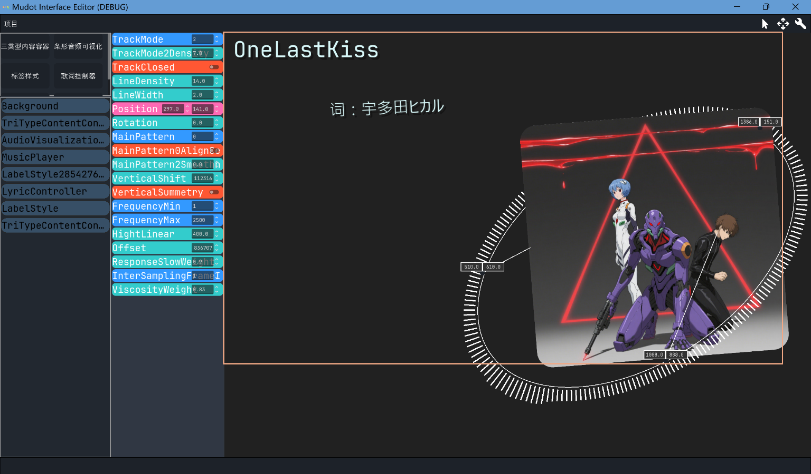

# **🎵 Mudot**  
*使用Godot编写的一个能够播放▶️和编辑✍️音乐包，并包含额外脚本📋的项目*  


## **目录**  
- [引言](#引言)
- [核心内容](#核心内容)
- [功能说明](#功能说明)
- [开发说明](#开发说明)
- [常见问题](#常见问题)
___

## **引言**    

> “没有什么好引的...”  


## 核心内容
一个播放器和一个编辑器

### 1.1 核心观点
播放器要求柔滑动画，  
编辑器主张屎堆代码。

### 1.2 图片展示
  
  
  
  

### **1.3 食用方法**  
开包(*.7z压缩包)即食

## **功能说明**  
### 2.1 播放器功能  
- 支持的音乐格式：`*.mp3`,`*.wav`,`*.ogg`
- 支持的视频格式：`*.ogv`
- 支持的图片格式：`*.bmp`,`*.png`,`*.webp`,`*.jpg`,`*.jpeg`,`*.tga`,`*.svg`
- 动画效果说明：非线性且几乎全覆盖

### 2.2 编辑器功能  
- 支持的编辑操作：自定义脚本gds(`*.gd`),添加|删除|更改节点
- 导出格式：文件夹
推荐格式:<br><br/>
```
project/
├── expand_script_dir/
│   ├── LyricController.gd
│   └── AudioVisualizationLinear.gd
├── src/
│   ├── 1.png
│   ├── 1.mp3
│   ├── 1.tscn(必须)
│   ├── 1.lrc
│   └── 1_variables.json(自动生成)
```
- 特色功能：目前没有[doge]  

## **开发说明**  
### 3.1 环境要求  
- Godot版本：v4.5.beta1.official [46c495ca2]
- 系统版本：Windows 11 x64

## **常见问题**  
| 问题 | 解决方案 |  
|------|----------|  
| 😑为什么如此简陋 | 因为要对标陋室铭 |  
| 😑为什么这么多bug | 因为夏天开始写的,虫子就是多(●'◡'●) |  
    
