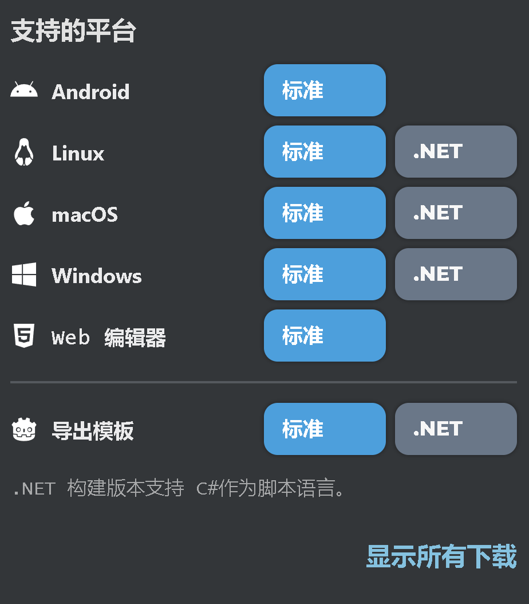
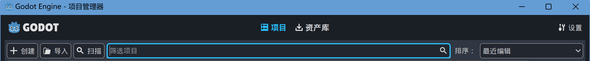

# 1. 项目安装教程(水)
本文档将详细指导你如何从 GitHub 上获取并安装我的 Mudot 项目，适用于 Windows、macOS 和 Linux 三种主流操作系统。

## 1. 项目基础信息

在开始安装前，请先了解项目的关键信息，确保你的环境与项目要求匹配：


*   **项目名称**：Mudot

*   **GitHub 仓库地址**：[Mudot](https://github.com/By-chi/Mudot/)

*   **适用 Godot 版本**：[v4.5.beta1.official [46c495ca2]](https://godotengine.org/download/archive/4.5-beta1/)

*   **项目类型**：音乐播放/编辑器

*   **额外依赖**：无

## 2. 安装

在安装项目前，需先完成以下前置环境的配置，这是确保项目正常运行的基础。

### 2.1 安装发布版本
**发布版本目前仅支持Windows11 x64**

| 下载方式 |链接|
|------|------|
| Github(推荐) | [点击下载](https://github.com/By-chi/Mudot/releases/latest)|
| 夸克云盘 | [点击下载](https://pan.quark.cn/s/c023cd048a9c?pwd=qxWS)|
| 阿里云盘(SFX) | [点击下载](https://www.alipan.com/s/Tt7feCnU7eo)|


### 2.2 下载源码

***项目依赖特定版本的 Godot 引擎，使用不匹配的版本可能导致项目报错或功能异常***


**准备工作(如果已安装对应版本跳过)**

- 访问 [Godot引擎官网](https://godotengine.org)->[对应版本下载页面](https://godotengine.org/download/archive/4.5-beta1/)；
- 下载对应操作系统版本的Godot:


- 解压下载的`Godot_v4.5-beta1_win64.exe.zip`
- 打开解压后的`Godot_v4.5-beta1_win64.exe`

**导入**

- 在窗口上栏上点击导入按钮:



## 3. 从 GitHub 克隆项目

**如果拥有桌面版的github，即可通过 Git 从 GitHub 克隆项目到本地**


1.  打开你常用的文件夹（例如 “文档” 文件夹），在该文件夹中打开终端 / 命令提示符：

*   **Windows 系统**：按住 `Shift` 键，右键点击文件夹空白处，选择 “在此处打开命令窗口” 或 “在此处打开 PowerShell 窗口”；

*   **macOS/Linux 系统**：打开终端，通过 `cd` 命令进入目标文件夹（例如 `cd ~/Documents`）。

1.  在终端 / 命令提示符中，输入以下命令克隆项目：


```
git clone https://github.com/By-chi/Mudot.git
```


1.  按下回车键后，Git 会开始下载项目文件，等待下载完成（进度条显示 100% 即完成）。下载完成后，目标文件夹中会新增一个与项目名称一致的文件夹，项目的所有文件都在该文件夹中。
## 6. 后续操作建议

成功安装项目后，你可以进行以下操作：


*   **查看项目文档**：

|文档链接|
|-------|
| [项目介绍](README.md) |
| [API文档](api.md) |
| [使用教程](tutorials.md) |
| [项目示例](ProjectExample/) |

*   **更新项目**：当项目 GitHub 仓库有更新时，在项目文件夹中打开终端，输入 `git pull` 命令，即可同步最新代码到本地。
