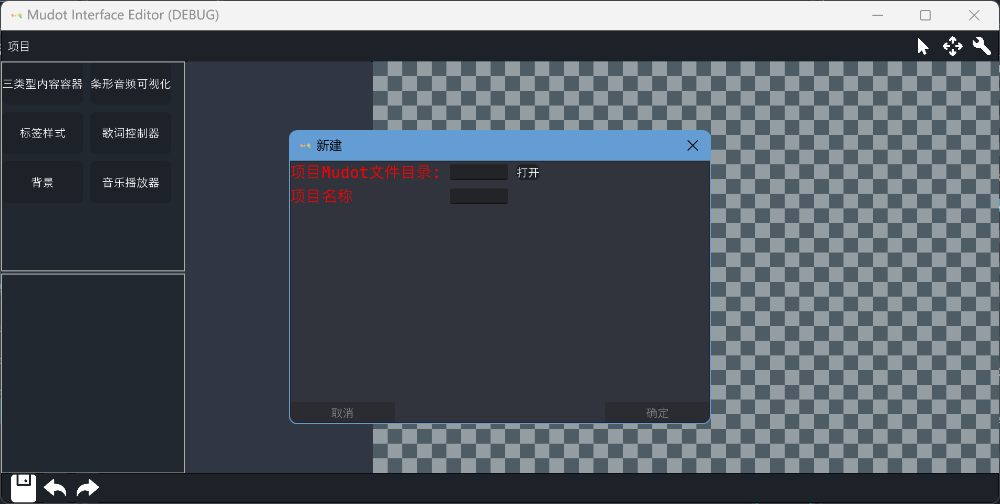
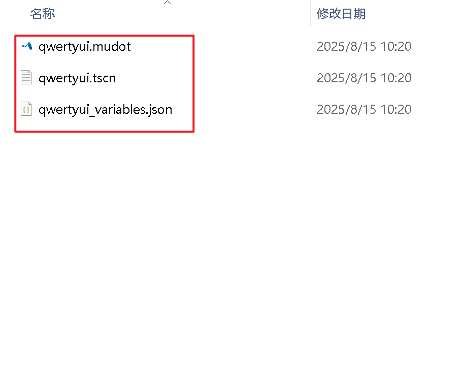
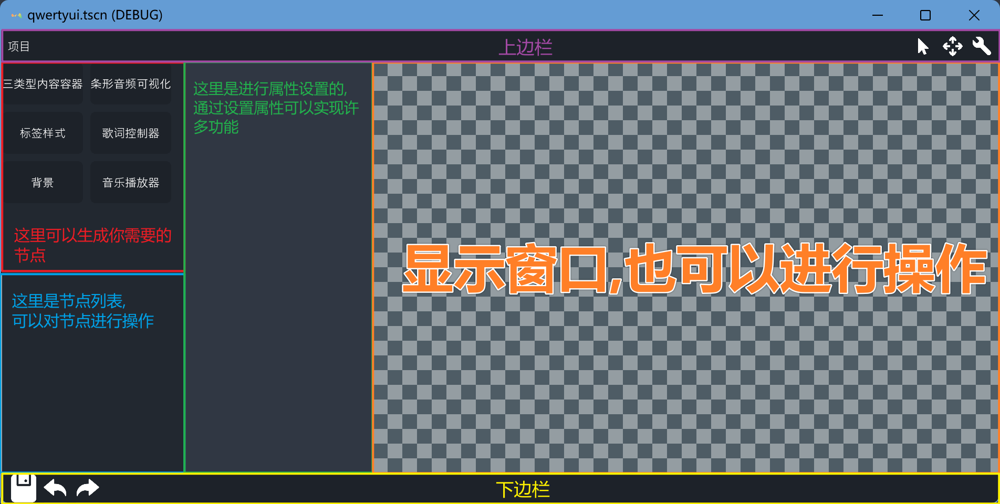
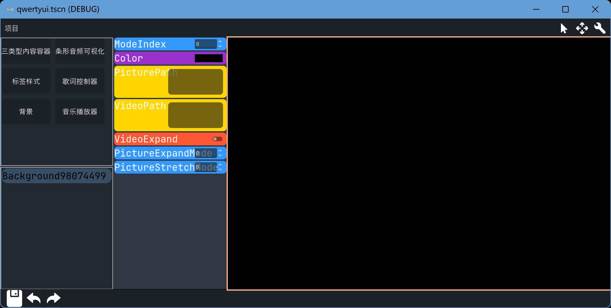
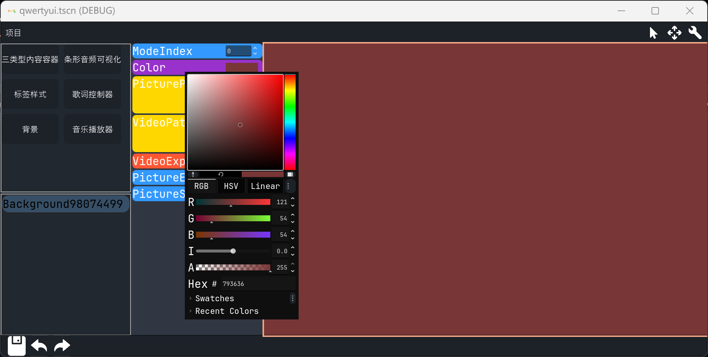
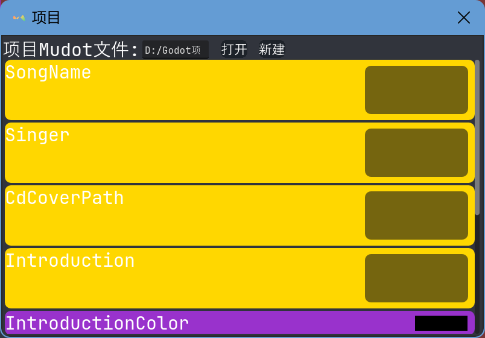

# 1. 使用教程(水)
本文档将详细指导你如何制作你的自定义播放内容和播放
__________
## 1. 检查版本

在开始安装前，请先了解项目的关键信息，确保你的环境与项目要求匹配：

*   **项目名称**：Mudot

*   **版本**：[最新](https://github.com/By-chi/Mudot/releases/latest)

*   **额外依赖**：无
___________
## 2. 创作

### 2.1 新建音乐包
*第一次打开会弹出新建窗口*

 

填写对应的内容,然后点击确定
_______

 

可以看到程序会生成3个文件:`*.mudot`,`*.tscn`和`*.json`
_______
### 2.2 界面布局
 

如图所示
_______

### 2.2 添加并修改节点
*点击左上角的节点列表中的任意一个按钮*
例如:

 

可以看到成功添加了一个背景
_______

*修改属性面板的任意属性*
例如:

 

可以看到成功更改了背景颜色
_______

## 3. 修改项目属性
### 3.1 打开项目设置窗口
*点击左上角上边栏的项目按钮*

 

在这里可以设置项目属性
_______

### 3.2 项目属性介绍

|属性名称|描述|
|-------|----|
|song_name|歌曲的名字  ※:这是必要的|
|singer|歌手|
|CD_cover_path|CD封面图片路径,最好是方形的|
|introduction|引言|
|introduction_color|引言颜色|
|template_path|场景路径  ※:这是必要的|
|list_cover_path|列表中显示的图片文件路径,最好是横向条形的|
|suggested_window_size|播放时推荐窗口大小  ※:此大小并不是此场景显示大小|
|expand_script_dir_path|拓展文件夹路径,脚本文件是GDscript,文件名(不包括拓展名部分)应对应节点的名字|

## 4 其他
*   **查看其他项目文档**：

|文档链接|
|-------|
| [项目介绍](README.md) |
| [API文档](api.md) |
| [使用教程](tutorials.md) |
| [项目示例](ProjectExample/) |
